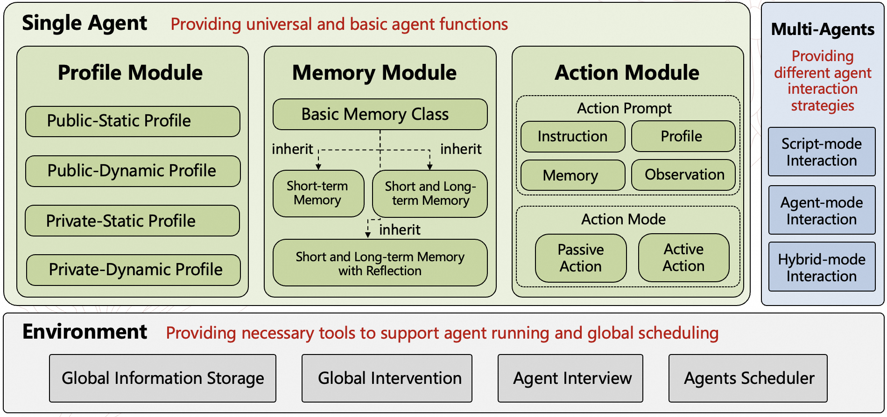
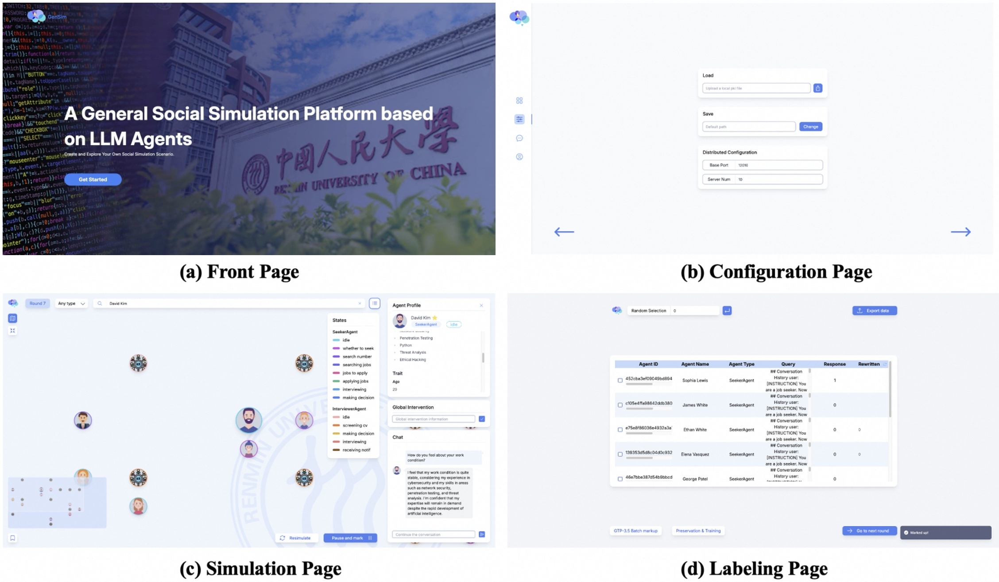

<div align=center>
    <h1>GenSim: A General Social Simulation Platform with Large Language Model based Agents</h1>
    
    
</div>

With the rapid advancement of large language models (LLMs), recent years have witnessed many promising studies on leveraging LLM-based agents to simulate human social behavior. While prior work has demonstrated significant potential across various domains, much of it has focused on specific scenarios involving a limited number of agents and has lacked the ability to adapt when errors occur during simulation. To overcome these limitations, we propose a novel LLM-agent-based simulation platform called GenSim, which: (1) Abstracts a set of general functions to simplify the simulation of customized social scenarios; (2) Supports one hundred thousand agents to better simulate large-scale populations in real-world contexts; (3) Incorporates error-correction mechanisms to ensure more reliable and long-term simulations. To evaluate our platform, we assess both the efficiency of large-scale agent simulations and the effectiveness of the error-correction mechanisms. To our knowledge, GenSim represents an initial step toward a general, large-scale, and correctable social simulation platform based on LLM agents, promising to further advance the field of social science.

<p align="center">
  
  <br>
  <b>Figure 1</b>: GenSim Framework
</p>

## Unique Features

💡 GenSim provides a **general programming framework** for customized social simulations

💡 GenSim supports large-scale social simulations (**up to 10w agents**)

💡 GenSim has **error-correction mechanisms** for more reliable social simulations


## 1. Platform Interface

<p align="center">
  
  <br>
  <b>Figure 2</b>: The platform interface
</p>


## 2. Usage
### 2.1 Installation
#### 2.1.1 Install Agentscope

Install from source code (https://github.com/pan-x-c/AgentScope/tree/feature/pxc/async_create_agent). 
- Add two lines of code in the ``__init__`` function of `OpenAIWrapperBase` in the file `src/agentscope/models/openai_model.py`:

  ```python
  self.api_key = api_key
  self.client_args = client_args or {}
  ```

#### 2.1.2 Clone the repository:
```
git clone https://github.com/TangJiakai/GenSim.git
```

#### 2.1.3 Install the required dependencies:
```
pip install -r requirements.txt
```

### 2.2 Launching the Embedding Models
#### 2.2.1 Running the Embedding Models
```
bash embedding_service/launch_multi_emb_models.sh
```
to launch the embedding model services.

*p.s. You can use embedding models like [m3e](https://modelscope.cn/models/Jerry0/m3e-base).*

#### 2.2.2 Embedding-Model Configuration
Get the `embedding_api` (for example, [http://localhost:8001/](http://localhost:8003/)), and fill that URL into `simulation/examples/<scenario>/configs/simulation_config.yml`.

p.s. 
- You can set multiply embedding models.

### 2.3 Launching the LLM Models
#### 2.3.1 [Optional] Running the LLM Models
```bash
bash llm_service/launch_all_llm.sh
```
to launch the LLM model server.

p.s. 
- You can set multiply LLM models.
- You can also use other LLM APIs based on vllm inference framework.

#### 2.3.2 LLM Configuration
Get the `llm_api` (for example, [http://localhost:8083/v1](http://localhost:8083/v1)), and fill that URL into `simulation/examples/<scenario>/configs/model_configs.json`. You can set multiply LLM models.

#### 2.3.3 Simualtion Configuration
Configure the following files in the configs directory of the specific scenario (e.g., `simulation/examples/<scenario>/configs`):

    - simulation_config.yml
    - memory_config.json
    - model_configs.json
    - xAgent_configs.json
    - yAgent_configs.json
    - ...

p.s. 
- The `x` and `y` in the file names are placeholders for the specific agent class.


### 2.4 Starting Simulation
#### 2.4.1 Launch Distributed Agent Server
Run the following command to launch the distributed server:
```bash
bash simulation/launch_server.sh <server_num_per_host> <base_port> <scenario>
```

p.s. 
- `<server_num_per_host>` is the number of servers per host (Typically less than or equal to the number of CPU cores on your computer); 
- `<base_port>` is the starting port number (GenSim will allocate agent servers on ports ranging from `base_port` to `base_port + server_num_per_host - 1`);  
- `<scenario>` is the name of the scenario you want to simulate.

#### 2.4.2 Run Simulator
Run the following command to launch the simulator:
```python
python simulation/examples/<scenario>/simulator.py
```

#### 2.4.3 Kill Distributed Server
After the simulation is completed, you can kill the distributed server.

Run the following command to kill the distributed server:
```bash
bash simulation/kill_all_server.sh
```

## 3. Efficiency and Effectiveness of GenSim
### 3.1 Efficiency
#### 3.1.1 Time Cost :vs: Agent Quality 

<p align="center">
  
  <br>
  <b>Figure 3</b>: The time costs of different numbers of agents
</p>
From Figure 3, it can be seen that as the scale of the agents increases, the simulation time approximately shows a linear growth trend. 

#### 3.1.2 Time Cost :vs: GPU Number 

<p align="center">
  
  <br>
  <b>Figure 4</b>: The time costs of different numbers of LLM
</p>
From Figure 4, it can be seen that as the number of GPUs increases, the simulation time decreases significantly.

### 3.2 Effectiveness

<p align="center">
  
  <br>
  <b>Figure 5</b>: The effects of our error-correction mechanism in single (a) and multi (b) rounds, respectively
</p>

We explore the evolution and enhancement of the model using two methods: SFT and PPO. 

- Figure 5(a) shows the impact of the number of training samples on the performance of the LLM-based agent. It is evident that the model demonstrates effective performance improvements across various sizes of training data. 

- Figure 5(b) illustrates the performance of continuous evolution enhancement in a multi-round setting, and it can be observed that our method has a good self-correction effect.

## Acknowledgement  
:rose: Gratitude is extended to the developers of [AgentScope](https://github.com/modelscope/agentscope), whose outstanding work has made this project possible. Their contributions have provided a solid foundation and essential tools that greatly enhanced the development process.

:sparkling_heart: Special thanks also go to [@GaoHeYang](https://github.com/PatrickG1014), [@WangLei](https://github.com/Paitesanshi), [@PanXuChen](https://github.com/pan-x-c), [@TanHaoRan](https://github.com/import-myself) and [@ChenYuShuo](https://github.com/chenyushuo) for their valuable contributions, feedback, and support throughout the course of this project. Their collaboration and insights have been instrumental in refining and improving the project.

:heart: Sincere appreciation is expressed to everyone who has contributed to the success of this project.


## :pencil: License

GenSim uses [MIT License](./LICENSE). All data and code in this project can only be used for academic purposes.

## :page_with_curl: Citation
If you find our work helpful for your research or application, please cite our papers.

[GenSim: A General Social Simulation Platform with Large Language Model based Agents](https://arxiv.org/abs/2410.04360)

  ```
  @misc{tang2024gensimgeneralsocialsimulation,
      title={GenSim: A General Social Simulation Platform with Large Language Model based Agents}, 
      author={Jiakai Tang and Heyang Gao and Xuchen Pan and Lei Wang and Haoran Tan and Dawei Gao and Yushuo Chen and Xu Chen and Yankai Lin and Yaliang Li and Bolin Ding and Jingren Zhou and Ji-Rong Wen},
      year={2024},
      eprint={2410.04360},
      archivePrefix={arXiv},
      primaryClass={cs.MA},
      url={https://arxiv.org/abs/2410.04360}, 
  }
  ```
